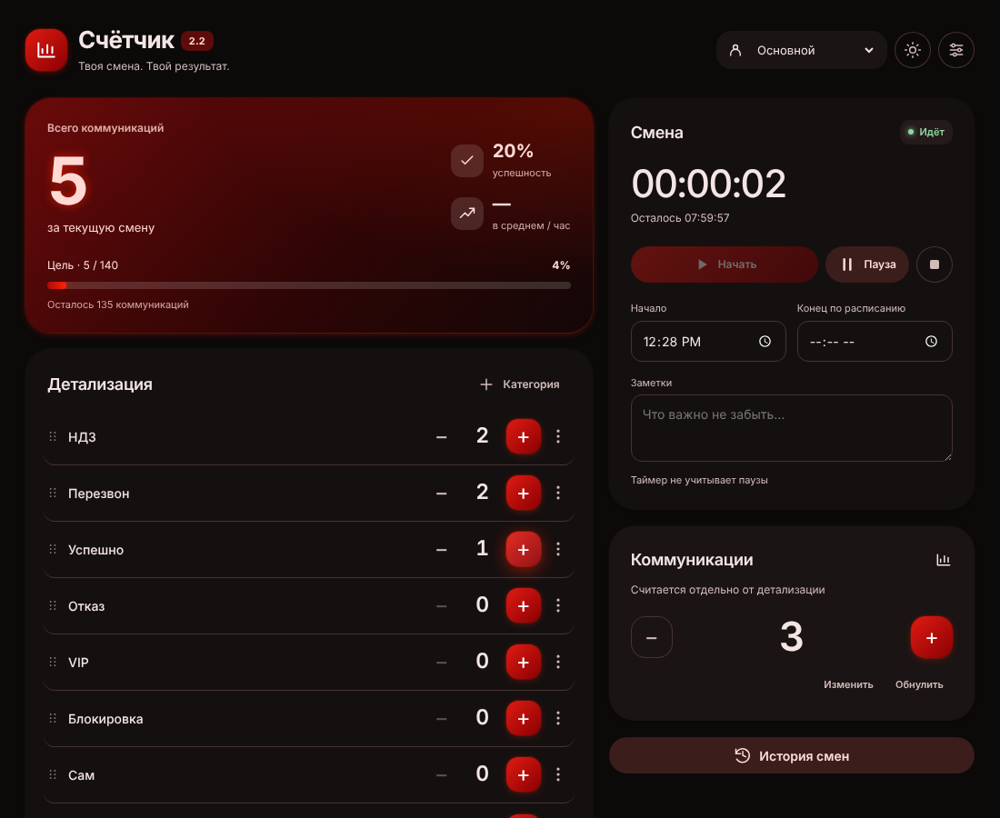

# COUNTER 2.0

Счётчик коммуникаций для Windows 10/11. Material Design 3 в цветах сквада (кроваво-красный, чёрный, алый), тёмная и светлая темы, свечение кнопок, анимации и локальное сохранение. Для использования нужен **один файл `COUNTER.exe`, около 373 КБ**. Отдельные HTML, DLL и `.config` рядом с программой не требуются.



## Скачать и запустить

- [COUNTER.exe](https://github.com/JEFFRIPPER/COUNTER/releases/latest/download/COUNTER.exe)
- [Весь проект с готовым EXE](https://github.com/JEFFRIPPER/COUNTER/releases/latest/download/COUNTER-V2.zip)

Все версии: [Releases](https://github.com/JEFFRIPPER/COUNTER/releases).

Распакуй весь проект и запусти `COPY-TO-DESKTOP.cmd`. Исходники и готовая программа скопируются в папку **`COUNTER V2` на рабочем столе** текущего пользователя. Запуск: `COUNTER V2\dist\COUNTER.exe`. Другие файлы в целевой папке не удаляются.

Для отдельного использования достаточно скачать EXE. Нужны установленные **.NET Framework 4.8** и **[Microsoft Edge WebView2 Runtime](https://developer.microsoft.com/microsoft-edge/webview2/)**. .NET SDK и Node.js нужны только разработчику; приложение работает без интернета. В составе нет собственного браузера: используется установленная системная среда WebView2.

## Возможности

- Детализация (справа): «Звонки» и «Успешно». Добавление, удаление, изменение количества и перетаскивание категорий.
- «Всего коммуникаций» и цель 140 считаются по «Звонкам»; «Успешно» — сколько из них успешных, отсюда процент успешности. Без категории «Звонки» итог — сумма категорий. «Коммуникации» (слева) — независимый счётчик; он не прибавляется к итогу.
- Профили с отдельными данными. Отмена до 49 последовательных действий. История последних 30 завершённых смен.
- Начало, пауза, продолжение и завершение смены, расписание и заметки. Ночная смена завершается на следующий день. Таймер не учитывает паузы.
- Цель 140 коммуникаций, успешность по категории «Успешно», средний темп после первой минуты работы. При обновлении до 2.4 старые категории сворачиваются: «Звонки» = их сумма, «Успешно» сохраняется; свои категории не меняются.
- Копирование отчёта, CSV с русскими названиями и разделителем «;» (Excel сразу раскладывает по столбцам), резервная копия всех профилей в JSON и её восстановление.
- Звук включается в настройках; по умолчанию выключен.

## Интерфейс

Эффекты (Настройки → «Эффекты»): **авто** включает полные анимации MD3 на мощном ПК и лёгкий режим на слабом (до 4 потоков процессора или меньше 4 ГБ памяти); **полные** и **лёгкие** выбираются вручную. Лёгкий режим отключает анимации, свечение и тени. Тёмная тема включена по умолчанию.

Цветовые роли MD3, тональные поверхности, округлые карточки, кнопки filled/tonal/outlined, диалоги и snackbar. Анимации отклика кнопок, чисел, прогресса и диалогов. Системная настройка уменьшения анимаций учитывается. Интерфейс адаптируется к узкому окну и масштабу экрана. Шрифты, иконки и эффекты не загружаются из интернета.

Ориентиры: [цветовая система Material 3](https://m3.material.io/styles/color/the-color-system), [анимации Material 3](https://m3.material.io/styles/motion). Это собственная реализация компонентов в HTML/CSS/JS внутри настольной оболочки WebView2.

## Данные

Счётчики сохраняются после каждого изменения. Данные браузера находятся в `%LOCALAPPDATA%\COUNTER\WebView2`. При первом запуске загрузчик WebView2 нужной архитектуры автоматически извлекается в `%LOCALAPPDATA%\COUNTER\Runtime`. Эти служебные файлы и установленная среда WebView2 занимают дополнительное место; 373 КБ — размер распространяемого EXE.

Ключи старой версии сохранены: `commProfiles`, `commStatsData_<имя>`, `commLastProfile`, `commStatsTheme`. Их содержимое поддерживается, если доступно в текущем хранилище. Старый каталог WebView2 другой оболочки автоматически не переносится; перед заменой старой версии сохрани важную статистику. Резервные копии версии 2.0 переносятся через «Настройки» → «Загрузить резервную копию».

Исправлены потеря паузы после перезапуска, повреждение снимков отмены, отмена завершения без отмены записи в истории, переименование профиля и ночное расписание. Названия и заметки выводятся текстом. CSV корректно обрабатывает запятые, кавычки и переносы строк.

## Обновления

При запуске программа проверяет последний [релиз на GitHub](https://github.com/JEFFRIPPER/COUNTER/releases/latest). Если версия новее, в программе открывается окно обновления с алой кнопкой «Обновить»; после «Позже» эта кнопка остаётся в верхней панели. После нажатия скачивается `COUNTER.exe` (с процентом загрузки), сверяется с `COUNTER.exe.sha256`, старый файл заменяется, и счётчик перезапускается. Данные в `%LOCALAPPDATA%\COUNTER` не затрагиваются. Без интернета проверка молча пропускается. Если обновить не получилось (например, в папку `Program Files` нельзя писать), окно предложит повторить или открыть страницу релизов для ручного скачивания. Отключить проверку: запуск с `--no-update-check`.

Выпуск новой версии: поднять `version` в `package.json` (и `package-lock.json`) и влить в `main`. Затем на GitHub: **Actions → «Проверка и сборка COUNTER» → Run workflow**, отметить «Опубликовать релиз» и нажать **Run workflow**. Другой способ: `git tag v2.1.0 && git push origin v2.1.0` (тег должен совпадать с версией). GitHub Actions соберёт и проверит EXE и опубликует релиз с `COUNTER.exe`, `COUNTER.exe.sha256` и `COUNTER-V2.zip`. Готовый EXE больше не хранится в git.

## Сборка

На Windows с .NET Framework 4.8:

```powershell
.\build.ps1
```

Сборка с копированием только EXE в указанную папку:

```powershell
.\build.ps1 -MirrorDirectory "$([Environment]::GetFolderPath('Desktop'))\COUNTER V2"
```

Сборка и копирование всего проекта:

```powershell
.\build.ps1 -Install
```

Копирование всего проекта с готовым EXE:

```powershell
.\install.ps1
```

Скрипт сборки загружает WebView2 SDK **1.0.4258.31** с NuGet и проверяет SHA-256 пакета. HTML, обе управляемые библиотеки и загрузчики x86/x64 сжимаются и встраиваются в EXE. Управляемые библиотеки загружаются из памяти; нативный загрузчик извлекается в служебный каталог. Исходники: `src/index.html` (разметка с маркерами `@@styles.css@@`, `@@core.js@@`, `@@app.js@@`), `src/styles.css`, `src/core.js` (расчёты), `src/app.js` (интерфейс), `src/Counter.cs`, `src/Updater.cs`, `src/app.manifest`, `src/counter.ico`. При сборке части склеиваются в один HTML; для тестов то же делает `tools/bundle.cjs` (`node tools/bundle.cjs out.html`). Версия программы берётся из `package.json`. Рядом с EXE создаётся `COUNTER.exe.sha256`.

## Проверка

```powershell
npm install
npm test
npx playwright install chromium
npm run test:ui
.\dist\COUNTER.exe --smoke-test
```

Тесты расчётов проверяют совместимость сохранённых счётчиков, паузу, ночное расписание и CSV. Проверки интерфейса охватывают профили, отмену, историю, CSV, JSON, темы и узкое окно. Native smoke test открывает реальный EXE в отдельном временном хранилище, проверяет встроенный интерфейс, счётчики, паузу, сохранение и перезагрузку. Возвращает код 0 при успехе, 1 при ошибке. GitHub Actions проверяет сборку на Windows.

Обновлено 6 октября 2026 года. Основой функций служит предыдущая программа «СЧЁТЧИК». DynamicIsland не входит в проект.
